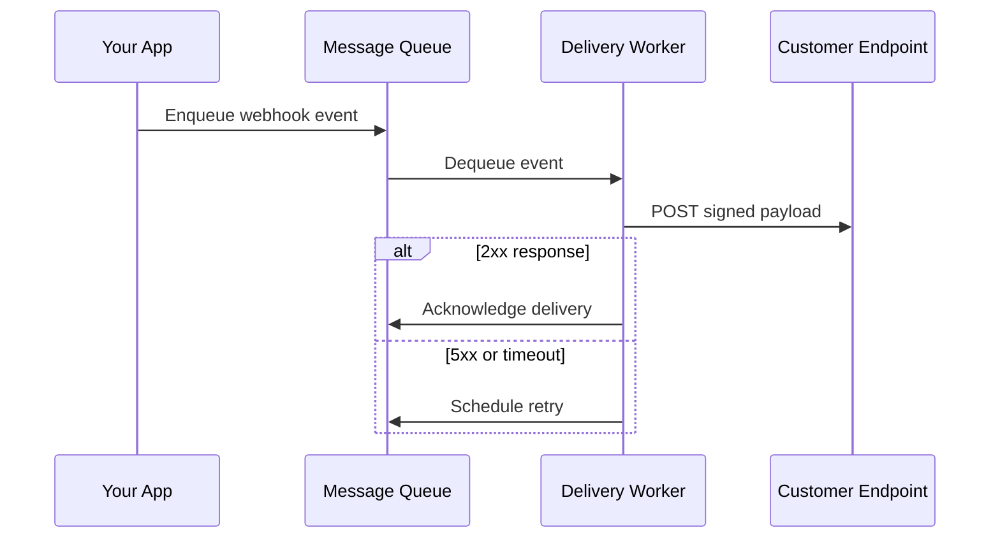
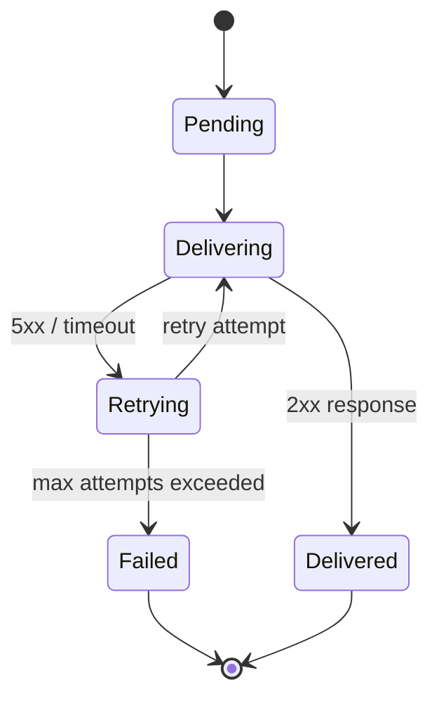
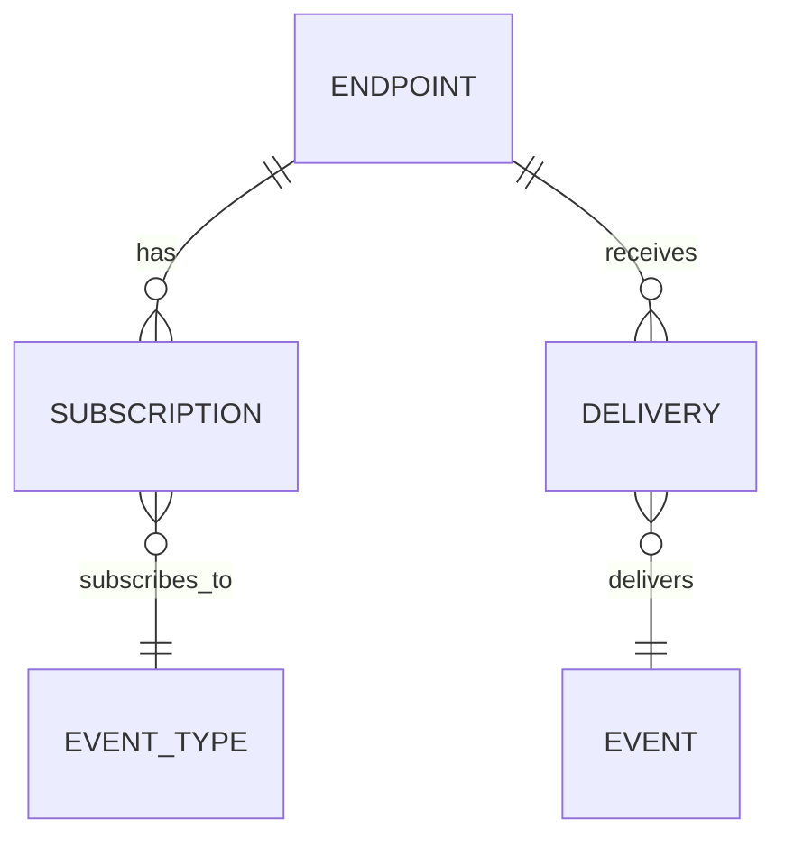
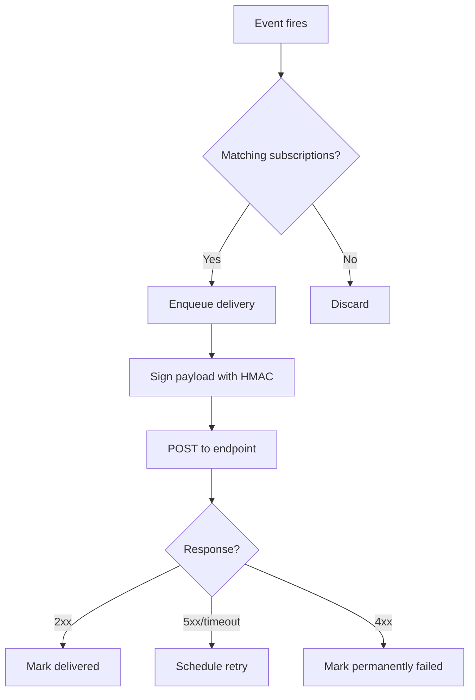

# Spec Image Types

Use visuals to communicate structure, flow, and relationships. A spec should combine well-structured natural language with visual models when prose alone is too slow to parse.

---

## Mermaid Diagrams

Use ````mermaid` fenced code blocks. Mermaid handles system flows, data models, state machines, business processes, and decision logic.

### Picking The Right Diagram

| What you need to show                                       | Diagram type            | Use it when                                          |
| ----------------------------------------------------------- | ----------------------- | ---------------------------------------------------- |
| Service flows, API interactions, multi-system communication | Sequence diagram        | Multiple actors exchange messages in a defined order |
| Business processes, decision logic, user flow branching     | Flowchart               | A process has branching paths and decision points    |
| Data entities and relationships                             | ER diagram              | Defining the logical data model                      |
| State transitions, lifecycle flows                          | State diagram           | An entity has a meaningful lifecycle                 |
| Cross-role processes                                        | Swimlane flowchart      | Showing who does what in a multi-role workflow       |
| Many condition/outcome combinations                         | Markdown decision table | Multiple conditions have distinct outcomes           |

### Examples

**Sequence diagram — service flow:**



**State diagram — lifecycle:**



**ER diagram — data model:**



**Flowchart — business process:**



Use notes and labels to call out important behavior. Keep diagrams focused: show the key flow, not every edge case.

---

## General Principles

- Visualize the complex or risky parts of the feature, not everything.
- Diagrams complement text; they do not replace written requirements.
- Give every diagram a unique identifier so requirements can cross-reference it.
- Use markdown tables for matrices, comparisons, and decision logic when a diagram would be harder to scan.
